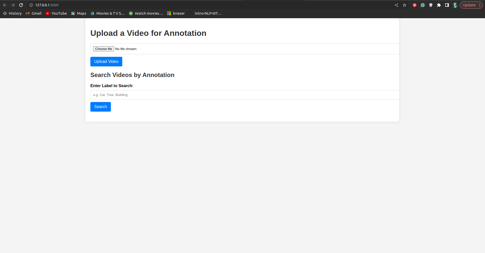
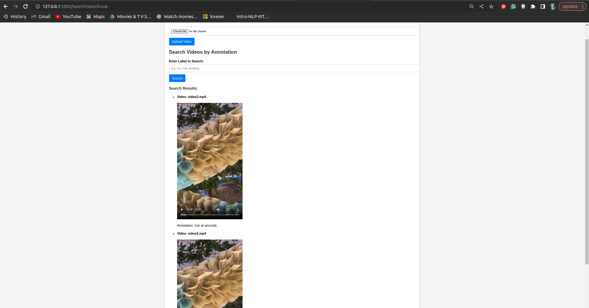
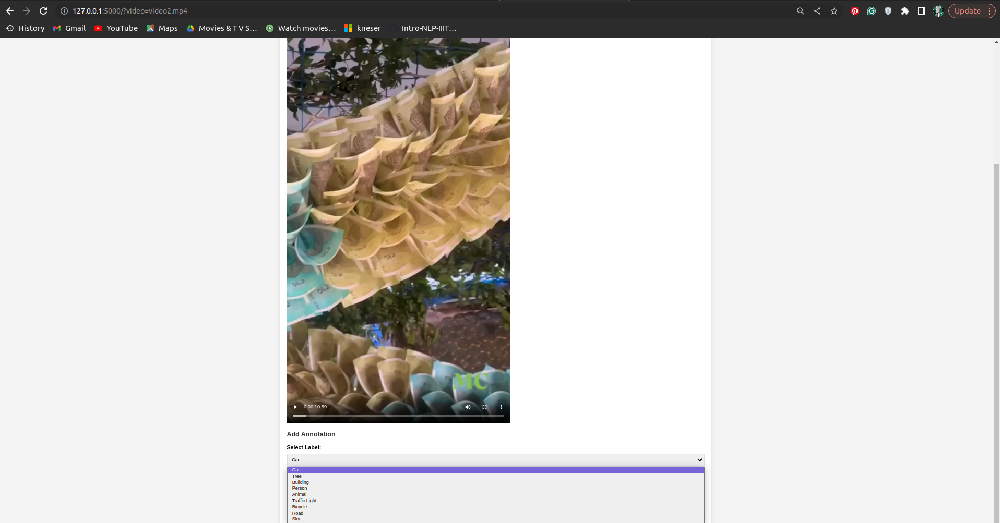

# Video Annotation Tool

## Overview

The Video Annotation Tool is a web-based application designed to facilitate the annotation of videos. It allows users to upload videos, add annotations at specific timestamps, and search for videos based on their annotations. The tool is ideal for applications requiring video analysis, such as machine learning datasets, video indexing, or content tagging.

## Features

- **Video Upload**: Upload video files for annotation.
- **Search Functionality**: Search for videos based on annotations.
- **Annotation Management**: Add and view annotations with timestamps.
- **Interactive Timeline**: Highlight annotations on the timeline and jump to specific timestamps.
- **Responsive Design**: Works across various devices and screen sizes.

## Installation

### Prerequisites

- Python 3.x
- Flask
- Basic HTML, CSS, and JavaScript

**Run the Application**

    
    python3 app.py

  By default, the application will be available at `http://127.0.0.1:5000`.

## Usage

1. **Upload a Video**

    Navigate to the home page and use the upload form to select and upload a video file.
    

2. **Search for Videos**

    Use the search form to find videos based on specific annotation labels.
    

3. **Add Annotations**

    Once a video is uploaded and displayed, pause the video at the desired timestamp, select a label from the dropdown, and submit the annotation form.
    

4. **View Annotations**

    Annotations for the current video will be listed with their timestamps. Click on an annotation to jump to its timestamp in the video.
    <video width="320" height="240" controls>
  <source src="view_annot.mp4" type="video/mp4">
</video>